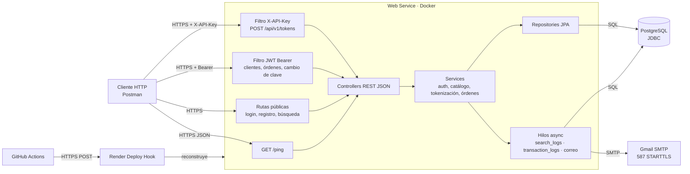

# orders

API de comercio para el reto Farmatodo: registro de clientes, catálogo, tokenización de tarjetas, carrito, pago y auditoría. Un solo proceso Spring Boot atiende HTTP, persiste en PostgreSQL y envía el correo de la orden por SMTP.

El detalle de reglas de negocio, migraciones y configuración está en [DOCUMENTACION.md](DOCUMENTACION.md). El despliegue comando a comando en Google Cloud está en [DESPLIEGUE_GCP.md](DESPLIEGUE_GCP.md).

## Descripción del sistema y sus componentes

| Componente | Qué hace | Protocolo |
| --- | --- | --- |
| Cliente HTTP (Postman) | Llama a la API | HTTPS, JSON |
| Filtro API Key | Protege `POST /api/v1/tokens` | Header `X-API-Key` |
| Filtro JWT | Protege clientes, órdenes y cambio de clave | `Authorization: Bearer` |
| Rutas públicas | `GET /ping`, login, refresh, registro y búsqueda de productos | HTTPS |
| Controllers | Contratos REST. Los errores de negocio salen como `{"message":"..."}` | HTTP |
| Services | Auth, catálogo, tokenización (AES-GCM), órdenes, correo y auditoría | Dentro del proceso |
| Hilos async | `search_logs`, `transaction_logs` y el envío de correo | No bloquean la respuesta HTTP |
| Repositories | Spring Data JPA. Flyway crea el esquema; Hibernate no genera tablas | SQL |
| PostgreSQL 15 | Usuarios, clientes, productos, tarjetas, órdenes, pagos y logs | JDBC |
| Gmail | Correo de pago aprobado o rechazado | SMTP 587, STARTTLS |
| GitHub Actions | CI/CT y, en `main`, el Deploy Hook | HTTPS |
| Render o Cloud Run | Ejecuta la imagen Docker | HTTPS |

No hay un banco externo. El rechazo de tokenización y de pago es un azar configurable (`RejectionGate`) dentro de la API.

Paquetes en `com.farmatodo.order`: `config` (seguridad, JWT, API key, async), `controller`, `domains`, `services`, `repositories`, `exceptions` y `templates` (HTML del correo).

## Diagrama de arquitectura



En Cloud Run el contenedor es el mismo. Cambia el destino del JDBC: Cloud SQL en lugar del Postgres de Render. El perfil `prod` hace que Hibernate valide el esquema (`ddl-auto: validate`) y no arranque si faltan la URL de la base, la API key, la clave de cifrado o el secreto JWT.

## Ejecutar en local

Hace falta JDK 21 (Temurin) y PostgreSQL 15. El proyecto no compila en 17. En Windows los comandos usan `gradlew.bat`; en Linux o macOS, `./gradlew`.

1. Crear la base. `ORDER` es palabra reservada, así que va entre comillas:

```sql
CREATE DATABASE "order";
```

Usuario `postgres`, clave `Post12.gres`, host `localhost`, puerto `5432`. Flyway crea las tablas al arrancar. No hace falta un perfil de Spring.

2. Levantar la API:

```text
gradlew.bat bootRun
```

Queda en `http://localhost:8130`. `GET /ping` responde `pong`.

La API key de `POST /api/v1/tokens` es `tokenization.api-key` en `src/main/resources/application.yaml`. El header es `X-API-Key`.

Con Docker no hace falta instalar PostgreSQL:

```text
docker compose up --build
```

La API queda en `http://localhost:8080`. Compose espera a que Postgres esté sano y conecta la app al host `postgres`.

## Pruebas

```text
gradlew.bat test
gradlew.bat check
```

`test` corre JUnit 5. `check` vuelve a correrlos y falla si JaCoCo baja de 80 % de líneas. El reporte HTML queda en `build/reports/jacoco/test/html`.

En GitHub, el workflow `ci-ct-pipeline.yml` hace lo mismo en cada push a `main` y en cada pull request: compila con JDK 21, corre los tests contra un PostgreSQL 15 de servicio y verifica la cobertura. Trivy informa vulnerabilidades altas y críticas y no bloquea el build. `cd-pipeline.yml` solo corre si CI/CT terminó bien en un push a `main` o `master`, y llama al Deploy Hook de Render. Ese hook se guarda en el secret `RENDER_DEPLOY_HOOK_URL`.

## Colección de Postman

Los ejemplos sueltos están en `http/*.curl`. La colección automatizada encadena el flujo: cada request guarda en variables lo que el siguiente necesita.

Crea un environment con `baseUrl` (`http://localhost:8130` o la URL desplegada) y `apiKey` (el valor de `tokenization.api-key`). Deja vacíos `accessToken`, `clientId`, `productId`, `orderId` y `cardToken`.

En la carpeta, en este orden:

1. `POST {{baseUrl}}/clients/make-registration`. En Pre-request genera usuario, clave y correo con `Date.now()` para que no choquen con uno ya guardado. El teléfono tiene que ser uno de `412`, `414`, `416`, `422`, `424` o `426`, con 7 dígitos, y puede llevar `58` o un `0` delante (`4141234567`, `04141234567`, `584141234567`). En Tests: `pm.collectionVariables.set("clientId", pm.response.json().id)`.
2. `POST {{baseUrl}}/auth/login` con `{{username}}` y `{{password}}`. Tests guarda `access_token` en `accessToken`.
3. `GET {{baseUrl}}/products/search?query=a&page=0&size=5`. Tests guarda `products[0].id` en `productId`.
4. `POST {{baseUrl}}/api/v1/tokens` con header `X-API-Key: {{apiKey}}` y `"client_id": {{clientId}}`. Tests guarda `token` en `cardToken`.
5. `POST {{baseUrl}}/orders` con `Authorization: Bearer {{accessToken}}` y `{ "client_id": {{clientId}} }`. Tests guarda `id` en `orderId`.
6. `POST {{baseUrl}}/orders/{{orderId}}/items` con `{ "product_id": {{productId}}, "quantity": 1 }`.
7. `POST {{baseUrl}}/orders/{{orderId}}/pay` con `{ "token": "{{cardToken}}" }`. El test espera status `200` y `status` del pago `APPROVED`.

Collection Runner ejecuta la carpeta en ese orden. Para la terminal:

```text
newman run orders.postman_collection.json -e local.postman_environment.json
```

Exporta la colección y el environment desde Postman antes de ese comando. Newman termina con código distinto de 0 si algún `pm.test` falla.

## Desplegar desde cero en GCP

La guía con cada comando está en [DESPLIEGUE_GCP.md](DESPLIEGUE_GCP.md). El orden es este:

1. Tener una cuenta de Google Cloud con facturación, `gcloud` instalado y este repositorio.
2. Crear el proyecto, vincular la facturación y habilitar Cloud Run, Artifact Registry, Cloud Build, Cloud SQL Admin, Service Networking, Secret Manager y VPC Access.
3. Crear la instancia Cloud SQL PostgreSQL 15, la base `farmatodo_db` y el usuario de la aplicación. La IP es privada, en la misma región que Cloud Run.
4. Generar y guardar en Secret Manager la clave de la base, `TOKENIZATION_API_KEY`, `TOKENIZATION_ENCRYPTION_KEY` y `SECURITY_JWT_SECRET`. No van en el repositorio ni en la imagen.
5. Construir la imagen con Cloud Build y subirla a Artifact Registry. El `Dockerfile` de la raíz compila con JDK 21 y corre con JRE 21.
6. Desplegar el servicio Cloud Run con `SPRING_PROFILES_ACTIVE=prod`, el conector de VPC hacia Cloud SQL y los secretos. Cloud Run inyecta `PORT`.

| Variable | Origen |
| --- | --- |
| `PORT` | Cloud Run, puerto `8080` |
| `SPRING_PROFILES_ACTIVE` | `prod` |
| `SPRING_DATASOURCE_URL` | `jdbc:postgresql://IP_PRIVADA:5432/farmatodo_db` |
| `SPRING_DATASOURCE_USERNAME` | Usuario de Cloud SQL |
| `SPRING_DATASOURCE_PASSWORD` | Secret Manager |
| `TOKENIZATION_API_KEY` | Secret Manager. Header `X-API-Key` |
| `TOKENIZATION_ENCRYPTION_KEY` | Secret Manager. Cifra el número de la tarjeta |
| `SECURITY_JWT_SECRET` | Secret Manager. Firma el access token |
| `TOKEN_REJECTION_RATE` | Opcional. Default `0.0` |
| `MIN_STOCK_THRESHOLD` | Opcional. Default `0` |
| `SPRING_MAIL_USERNAME` | Opcional. Cuenta SMTP |
| `SPRING_MAIL_PASSWORD` | Opcional. Secret Manager |

Al terminar, `GET /ping` en la URL del servicio responde `pong`. Flyway aplica las migraciones en el primer arranque.
